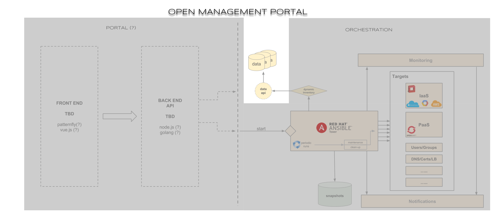

# Open Management Portal - Data API

## Architecture

## How to deploy on OpenShift Container Platform

Ensure you're logged into your cluster on your cli by running:

- `oc login`

Next navigate to the applier directory:

- `cd .openshift-applier`

Then kick off the openshift-applier using the container image:

- `./run.sh`

This will create an `omp-ci-cd` and `omp-dev` project with a build pipeline for the application.

## How to deploy locally
To deploy locally, the api **must** have a mongo instance to point to. 

Recommended mongo deployment:

- `docker run -d --rm --name mongodb -p 27017:27017 bitnami/mongodb:latest`

In order to attach to this mongo instance, the api needs to have `DATABASE_CONNECTION_STRING` set as an environment variable:

- `DATABASE_CONNECTION_STRING=mongodb://127.0.0.1/testdb`

To start the api:

- `npm run start` 

To start the api with auto-reloading:

- `npm run dev`

To run test cases:

- `npm run test`

